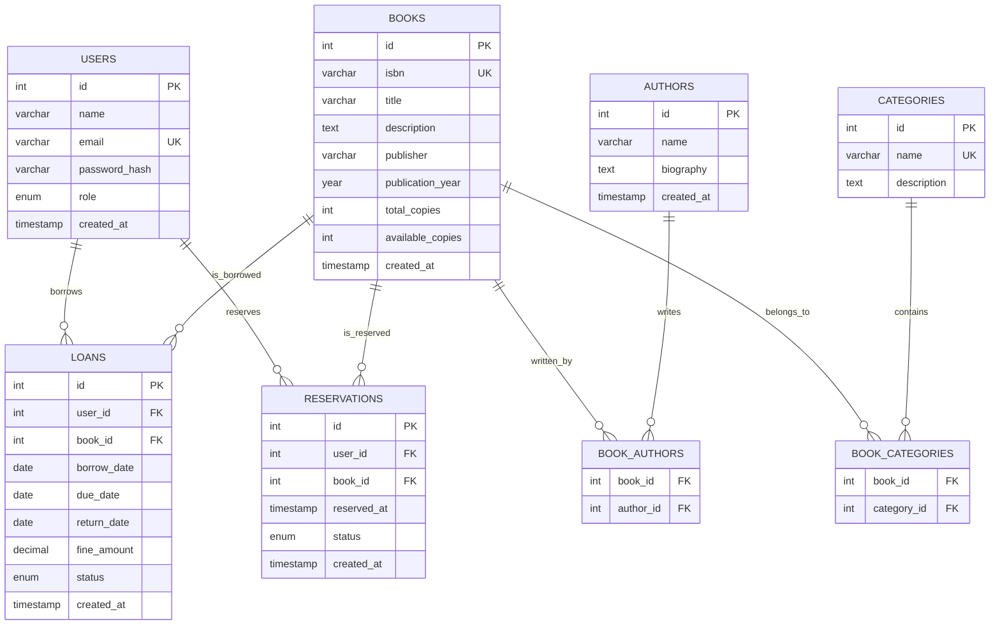

# Entity Relationship Diagram (ERD)

## Database Schema Overview

The Library Management System uses a relational MySQL database with the following entities and relationships.

## ERD Diagram (Mermaid)



## Entity Descriptions

### 1. USERS

Stores information about all system users (members, librarians, admins).

**Attributes**:

- `id`: Primary key, auto-increment
- `name`: Full name of the user
- `email`: Unique email address for login
- `password_hash`: Bcrypt hashed password
- `role`: ENUM('member', 'librarian', 'admin') - User role
- `created_at`: Account creation timestamp

**Relationships**:

- One user can have many loans (1:N)
- One user can have many reservations (1:N)

### 2. BOOKS

Contains the library's book catalog.

**Attributes**:

- `id`: Primary key, auto-increment
- `isbn`: Unique ISBN identifier
- `title`: Book title
- `description`: Book description/synopsis
- `publisher`: Publishing company
- `publication_year`: Year of publication
- `total_copies`: Total number of copies owned
- `available_copies`: Currently available copies
- `created_at`: Record creation timestamp

**Relationships**:

- One book can have many authors (M:N via BOOK_AUTHORS)
- One book can belong to many categories (M:N via BOOK_CATEGORIES)
- One book can have many loans (1:N)
- One book can have many reservations (1:N)

### 3. AUTHORS

Stores author information.

**Attributes**:

- `id`: Primary key, auto-increment
- `name`: Author's full name
- `biography`: Brief biography
- `created_at`: Record creation timestamp

**Relationships**:

- One author can write many books (M:N via BOOK_AUTHORS)

### 4. CATEGORIES

Book categorization/genres.

**Attributes**:

- `id`: Primary key, auto-increment
- `name`: Unique category name
- `description`: Category description

**Relationships**:

- One category can contain many books (M:N via BOOK_CATEGORIES)

### 5. BOOK_AUTHORS (Junction Table)

Many-to-many relationship between books and authors.

**Attributes**:

- `book_id`: Foreign key to BOOKS
- `author_id`: Foreign key to AUTHORS
- Composite primary key (book_id, author_id)

### 6. BOOK_CATEGORIES (Junction Table)

Many-to-many relationship between books and categories.

**Attributes**:

- `book_id`: Foreign key to BOOKS
- `category_id`: Foreign key to CATEGORIES
- Composite primary key (book_id, category_id)

### 7. LOANS

Tracks book borrowing transactions.

**Attributes**:

- `id`: Primary key, auto-increment
- `user_id`: Foreign key to USERS
- `book_id`: Foreign key to BOOKS
- `borrow_date`: Date book was borrowed
- `due_date`: Date book is due for return
- `return_date`: Actual return date (NULL if not returned)
- `fine_amount`: Calculated fine for late return
- `status`: ENUM('borrowed', 'returned', 'overdue')
- `created_at`: Record creation timestamp

**Relationships**:

- Many loans belong to one user (N:1)
- Many loans reference one book (N:1)

### 8. RESERVATIONS

Manages book reservations.

**Attributes**:

- `id`: Primary key, auto-increment
- `user_id`: Foreign key to USERS
- `book_id`: Foreign key to BOOKS
- `reserved_at`: Timestamp of reservation
- `status`: ENUM('active', 'cancelled', 'fulfilled')
- `created_at`: Record creation timestamp

**Relationships**:

- Many reservations belong to one user (N:1)
- Many reservations reference one book (N:1)

## Database Constraints

### Primary Keys

- All tables have an auto-incrementing integer primary key named `id`
- Junction tables use composite primary keys

### Foreign Keys

- All foreign keys have ON DELETE CASCADE or RESTRICT based on business rules
- Indexes created on foreign key columns for performance

### Unique Constraints

- `users.email`: Ensures unique user accounts
- `books.isbn`: Ensures unique book identification
- `categories.name`: Prevents duplicate categories

### Check Constraints

- `books.available_copies <= total_copies`: Logical consistency
- `loans.due_date >= borrow_date`: Date validation
- `loans.fine_amount >= 0`: Non-negative fines

## Indexes

For optimal query performance:

```sql
-- Search indexes
CREATE INDEX idx_books_title ON books(title);
CREATE INDEX idx_books_isbn ON books(isbn);
CREATE INDEX idx_authors_name ON authors(name);

-- Foreign key indexes
CREATE INDEX idx_loans_user_id ON loans(user_id);
CREATE INDEX idx_loans_book_id ON loans(book_id);
CREATE INDEX idx_reservations_user_id ON reservations(user_id);
CREATE INDEX idx_reservations_book_id ON reservations(book_id);

-- Status indexes for filtering
CREATE INDEX idx_loans_status ON loans(status);
CREATE INDEX idx_reservations_status ON reservations(status);
```

## Normalization

The database follows **Third Normal Form (3NF)**:

- All attributes are atomic (1NF)
- No partial dependencies on composite keys (2NF)
- No transitive dependencies (3NF)
- Junction tables eliminate many-to-many relationships
