# Use Case Diagrams

## System Overview

The Library Management System supports three primary actors with distinct use cases.

## Actors

1. **Member**: Regular library users who can browse, borrow, and reserve books
2. **Librarian**: Staff members who manage day-to-day operations
3. **Admin**: System administrators with full access and control

## Use Case Diagram (Mermaid)

```mermaid
graph TB
    subgraph "Library Management System"
        UC1[Register Account]
        UC2[Login]
        UC3[Browse Book Catalog]
        UC4[Search Books]
        UC5[View Book Details]
        UC6[Borrow Book]
        UC7[Return Book]
        UC8[Reserve Book]
        UC9[Cancel Reservation]
        UC10[View My Loans]
        UC11[View My Reservations]
        UC12[Pay Fines]
        UC13[Add Book]
        UC14[Edit Book]
        UC15[Delete Book]
        UC16[Manage Members]
        UC17[View All Loans]
        UC18[Process Return]
        UC19[Generate Reports]
        UC20[Manage Categories]
        UC21[System Configuration]
    end
    
    Member([Member])
    Librarian([Librarian])
    Admin([Admin])
    
    Member --> UC1
    Member --> UC2
    Member --> UC3
    Member --> UC4
    Member --> UC5
    Member --> UC6
    Member --> UC7
    Member --> UC8
    Member --> UC9
    Member --> UC10
    Member --> UC11
    Member --> UC12
    
    Librarian --> UC2
    Librarian --> UC3
    Librarian --> UC4
    Librarian --> UC13
    Librarian --> UC14
    Librarian --> UC17
    Librarian --> UC18
    Librarian --> UC19
    
    Admin --> UC2
    Admin --> UC13
    Admin --> UC14
    Admin --> UC15
    Admin --> UC16
    Admin --> UC17
    Admin --> UC19
    Admin --> UC20
    Admin --> UC21
```

## Detailed Use Cases

### Member Use Cases

#### UC1: Register Account

**Actor**: Member  
**Description**: New user creates an account to access the system  
**Preconditions**: None  
**Postconditions**: User account is created and can log in  

**Main Flow**:

1. User navigates to registration page
2. User enters name, email, and password
3. System validates input (email format, password strength)
4. System checks email uniqueness
5. System hashes password and creates account
6. System sends confirmation message
7. User is redirected to login page

**Alternative Flows**:

- 3a. Validation fails → Display error message
- 4a. Email already exists → Display error message

---

#### UC2: Login

**Actor**: Member, Librarian, Admin  
**Description**: User authenticates to access the system  
**Preconditions**: User has a registered account  
**Postconditions**: User is authenticated and receives JWT token  

**Main Flow**:

1. User enters email and password
2. System validates credentials
3. System generates JWT token
4. System returns token to client
5. User is redirected to dashboard

**Alternative Flows**:

- 2a. Invalid credentials → Display error message
- 2b. Account locked → Display error message

---

#### UC3: Browse Book Catalog

**Actor**: Member, Librarian  
**Description**: User views the complete book catalog  
**Preconditions**: User is logged in  
**Postconditions**: Book list is displayed  

**Main Flow**:

1. User navigates to catalog page
2. System retrieves books with pagination
3. System displays books with basic info (title, author, availability)
4. User can navigate pages

---

#### UC4: Search Books

**Actor**: Member, Librarian  
**Description**: User searches for specific books  
**Preconditions**: User is logged in  
**Postconditions**: Matching books are displayed  

**Main Flow**:

1. User enters search criteria (title, author, ISBN, category)
2. System queries database with filters
3. System returns matching results with pagination
4. User views search results

**Alternative Flows**:

- 2a. No results found → Display "No books found" message

---

#### UC5: View Book Details

**Actor**: Member, Librarian  
**Description**: User views detailed information about a book  
**Preconditions**: User is logged in  
**Postconditions**: Book details are displayed  

**Main Flow**:

1. User clicks on a book from catalog/search results
2. System retrieves complete book information
3. System displays title, authors, description, ISBN, availability, etc.
4. User can choose to borrow or reserve

---

#### UC6: Borrow Book

**Actor**: Member  
**Description**: Member borrows an available book  
**Preconditions**: User is logged in, book is available, user hasn't exceeded loan limit  
**Postconditions**: Book is marked as borrowed, available copies decremented  

**Main Flow**:

1. User clicks "Borrow" button on book details page
2. System checks book availability
3. System checks user's current loan count
4. System creates loan record with due date (14 days from today)
5. System decrements available copies
6. System displays success message with due date
7. User is redirected to "My Loans" page

**Alternative Flows**:

- 2a. Book not available → Offer reservation option
- 3a. User exceeded loan limit → Display error message
- 3b. User has overdue books → Display warning and prevent borrowing

---

#### UC7: Return Book

**Actor**: Member, Librarian  
**Description**: Member returns a borrowed book  
**Preconditions**: User has borrowed the book  
**Postconditions**: Book is marked as returned, fines calculated if overdue  

**Main Flow**:

1. User clicks "Return" button on loan
2. System sets return date to today
3. System calculates days overdue (if any)
4. System calculates fine (days * rate)
5. System updates loan status to "returned"
6. System increments book available copies
7. System checks for active reservations
8. System displays success message with fine (if applicable)

**Alternative Flows**:

- 7a. Reservation exists → Notify first user in queue

---

#### UC8: Reserve Book

**Actor**: Member  
**Description**: Member reserves an unavailable book  
**Preconditions**: User is logged in, book has no available copies  
**Postconditions**: Reservation is created  

**Main Flow**:

1. User clicks "Reserve" button on book details page
2. System checks if book is unavailable
3. System checks if user already has active reservation for this book
4. System creates reservation record
5. System displays success message
6. User receives queue position

**Alternative Flows**:

- 2a. Book is available → Suggest borrowing instead
- 3a. User already reserved this book → Display error message

---

#### UC9: Cancel Reservation

**Actor**: Member  
**Description**: Member cancels an active reservation  
**Preconditions**: User has an active reservation  
**Postconditions**: Reservation is cancelled  

**Main Flow**:

1. User clicks "Cancel" button on reservation
2. System updates reservation status to "cancelled"
3. System displays success message
4. Next user in queue is notified

---

#### UC10: View My Loans

**Actor**: Member  
**Description**: Member views their borrowing history  
**Preconditions**: User is logged in  
**Postconditions**: Loan list is displayed  

**Main Flow**:

1. User navigates to "My Loans" page
2. System retrieves all user's loans
3. System displays active and past loans with status
4. System highlights overdue loans
5. System shows total outstanding fines

---

#### UC11: View My Reservations

**Actor**: Member  
**Description**: Member views their active reservations  
**Preconditions**: User is logged in  
**Postconditions**: Reservation list is displayed  

**Main Flow**:

1. User navigates to "My Reservations" page
2. System retrieves user's reservations
3. System displays reservation details and queue position
4. User can cancel reservations

---

#### UC12: Pay Fines

**Actor**: Member  
**Description**: Member pays outstanding fines  
**Preconditions**: User has outstanding fines  
**Postconditions**: Fines are marked as paid  

**Main Flow**:

1. User views outstanding fines on dashboard
2. User clicks "Pay Fines" button
3. System displays fine details
4. User confirms payment
5. System marks fines as paid
6. System displays receipt

**Note**: Payment integration is simplified for this project (manual confirmation)

---

### Librarian Use Cases

#### UC13: Add Book

**Actor**: Librarian, Admin  
**Description**: Add a new book to the catalog  
**Preconditions**: User has librarian or admin role  
**Postconditions**: New book is added to catalog  

**Main Flow**:

1. Librarian navigates to "Add Book" page
2. Librarian enters book details (title, ISBN, description, etc.)
3. Librarian selects/adds authors
4. Librarian selects/adds categories
5. Librarian enters number of copies
6. System validates input (unique ISBN)
7. System creates book record
8. System displays success message

**Alternative Flows**:

- 6a. ISBN already exists → Display error message

---

#### UC14: Edit Book

**Actor**: Librarian, Admin  
**Description**: Update existing book information  
**Preconditions**: User has librarian or admin role  
**Postconditions**: Book information is updated  

**Main Flow**:

1. Librarian searches for book
2. Librarian clicks "Edit" button
3. System displays pre-filled form
4. Librarian modifies fields
5. System validates changes
6. System updates book record
7. System displays success message

---

#### UC17: View All Loans

**Actor**: Librarian, Admin  
**Description**: View and manage all active loans  
**Preconditions**: User has librarian or admin role  
**Postconditions**: All loans are displayed  

**Main Flow**:

1. Librarian navigates to "All Loans" page
2. System retrieves all loans
3. System displays loans with filters (status, user, overdue)
4. Librarian can process returns or extend due dates

---

#### UC18: Process Return

**Actor**: Librarian  
**Description**: Librarian processes book return on behalf of member  
**Preconditions**: User has librarian role, loan exists  
**Postconditions**: Same as UC7  

---

#### UC19: Generate Reports

**Actor**: Librarian, Admin  
**Description**: Generate various statistical reports  
**Preconditions**: User has librarian or admin role  
**Postconditions**: Report is generated and displayed  

**Main Flow**:

1. Librarian navigates to "Reports" page
2. Librarian selects report type (most borrowed, overdue, member activity)
3. Librarian sets date range
4. System queries database and generates report
5. System displays report with charts/tables
6. Librarian can export to CSV

---

### Admin Use Cases

#### UC15: Delete Book

**Actor**: Admin  
**Description**: Remove a book from the catalog  
**Preconditions**: User has admin role, book has no active loans  
**Postconditions**: Book is deleted  

**Main Flow**:

1. Admin searches for book
2. Admin clicks "Delete" button
3. System checks for active loans
4. System displays confirmation dialog
5. Admin confirms deletion
6. System deletes book and related records
7. System displays success message

**Alternative Flows**:

- 3a. Active loans exist → Display error, prevent deletion

---

#### UC16: Manage Members

**Actor**: Admin  
**Description**: View and manage user accounts  
**Preconditions**: User has admin role  
**Postconditions**: Member accounts are managed  

**Main Flow**:

1. Admin navigates to "Members" page
2. System displays all users
3. Admin can edit roles, suspend accounts, or reset passwords
4. System updates user records

---

#### UC20: Manage Categories

**Actor**: Admin  
**Description**: Add, edit, or delete book categories  
**Preconditions**: User has admin role  
**Postconditions**: Categories are updated  

---

#### UC21: System Configuration

**Actor**: Admin  
**Description**: Configure system settings  
**Preconditions**: User has admin role  
**Postconditions**: Settings are updated  

**Main Flow**:

1. Admin navigates to "Settings" page
2. Admin modifies settings (fine rate, loan duration, max loans)
3. System validates values
4. System updates configuration
5. System displays success message

## Use Case Priorities

### High Priority (MVP)

- UC1, UC2: Authentication
- UC3, UC4, UC5: Book browsing
- UC6, UC7: Borrowing and returning
- UC10: View my loans

### Medium Priority

- UC8, UC9, UC11: Reservations
- UC13, UC14: Book management
- UC17, UC18: Loan management

### Low Priority (Nice to Have)

- UC12: Fine payment
- UC19: Advanced reporting
- UC20, UC21: Advanced admin features
